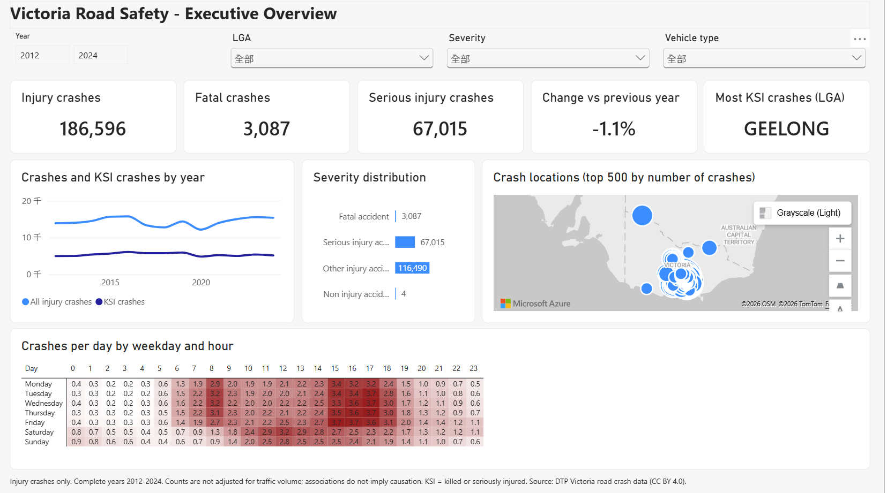
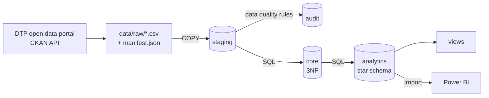
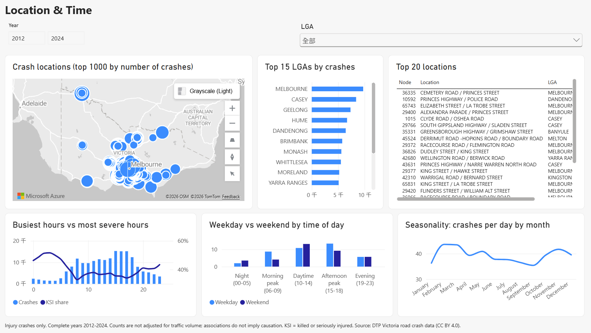
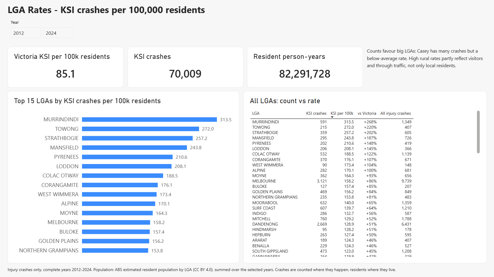
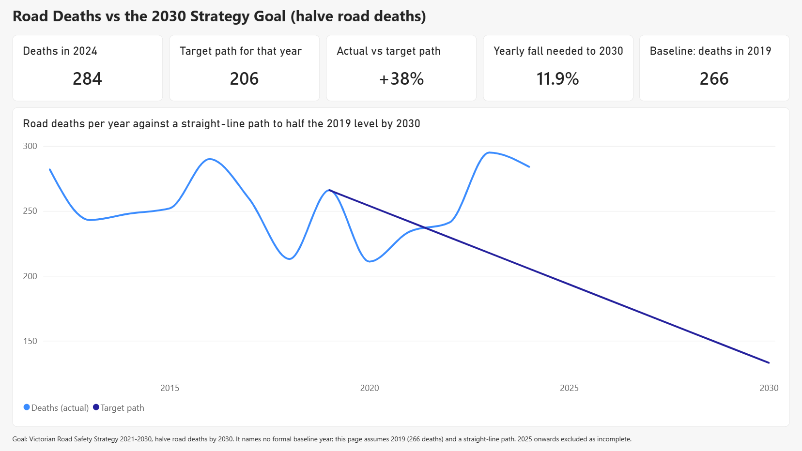

# Victoria Road Safety Analytics

An end-to-end analytics project on Victoria's road crash data. A Python pipeline loads ten
open data files (about 2.9 million rows) into PostgreSQL. Along the way it checks them against
a set of data quality rules and models them as a star schema. SQL then answers road safety
questions, and a Power BI dashboard presents the results.

I built this to practise the full path from raw files to a dashboard someone could actually use:

- database design
- data quality
- SQL analysis
- query performance



## Overview

- **Pipeline:** download from the government open data API → staging → cleaned relational tables → star schema. It runs as one database transaction.
- **Data quality:** 30 documented rules. Problems are fixed, flagged or rejected, never silently deleted, and every run writes a [data quality report](docs/data_quality_report.md).
- **Analysis:** 18 SQL queries, each answering one question, plus reporting views and a materialized view.
- **Performance:** indexes chosen by measuring `EXPLAIN ANALYZE` before and after, including one index I measured and then rejected.
- **Dashboard:** five Power BI pages, saved as a Power BI Project so the model and pages are text files in Git. Two of them report performance: crash rates per resident (ABS population shaped in Power Query) and road deaths against the state's 2030 goal.
- **Paginated report:** a printable monthly LGA performance report in RDL, the SSRS / Power BI Report Builder format, with parameters and conditional formatting.
- **Tests:** 100 pytest tests, covering unit logic, database constraints and reconciliation of the results against the source.

## Business Problem

Road safety teams have limited budgets for enforcement, education and engineering, so they need
to know where and when injury crashes happen, and what is associated with the severe ones.

The questions I set out to answer:

| Area | Questions |
|---|---|
| Trends | Are crashes, and fatal or serious crashes, rising or falling? |
| Time | Which hours and days are worst? Do weekends differ? Is there seasonality? |
| Location | Which LGAs and which specific intersections have the most crashes? How concentrated are they? |
| Environment | How do weather, road surface and lighting relate to severity? |
| Vehicles and people | Which vehicles and road users are most often involved in, or hurt in, severe crashes? |

## Architecture



- Python handles download, loading, orchestration and testing.
- SQL does the transformation and analysis, because that is where the data lives and what the database is good at.
- More detail is in [docs/architecture.md](docs/architecture.md).

## Dataset

[Victoria road crash data](https://opendata.transport.vic.gov.au/dataset/victoria-road-crash-data),
published by the Department of Transport and Planning (DTP) under CC BY 4.0.

- Nine related CSV files describe crashes, people, vehicles, locations, weather, road surface and crash events. A tenth file is DTP's own one-row-per-crash summary, which I used to check my results.
- The snapshot I used covers crash dates from 2012-01-01 to 2026-01-31 (200,754 crashes). The exact download is recorded in [data/raw/manifest.json](data/raw/manifest.json).
- **Reference data:** ABS estimated resident population by LGA, 2001-2025 ([Regional population 2024-25](https://www.abs.gov.au/statistics/people/population/regional-population/latest-release), CC BY 4.0), in [data/reference/](data/reference/). It turns crash counts into rates per resident.

Three limitations shape every result:

- **Injury crashes only.** There are 4 non-injury crashes in 200,754 records.
- **Incomplete recent months.** The data is published with a lag, so trends use the complete years 2012-2024.
- **No traffic exposure data.** There are no traffic volumes, so counts are not risk rates, and every association is just that, not a cause. Population gives a per-resident rate, but crashes happen where people drive, not only where they live.

## Tech Stack

| Tool | Used for |
|---|---|
| PostgreSQL 17 | Storage, constraints, transformations, views, indexing |
| Python 3.13 (psycopg, requests, pandas, python-dotenv) | Download, bulk load with `COPY`, validation runner, reports, profiling |
| SQL | Cleaning, dimensional modelling, analysis, performance tuning |
| pytest | Unit, constraint and data tests |
| Power BI Desktop (PBIP: TMDL + PBIR) | Dashboard, DAX measures, Power Query (M) |
| Power BI Report Builder (RDL) + psqlODBC | Paginated, printable report with parameters |
| Jupyter + matplotlib | Initial data profiling |
| Git / GitHub | Version control, one commit per phase |

## Database Design

I split the database into four schemas:

| Schema | Role |
|---|---|
| `staging` | Every source column as text, so nothing is lost on load |
| `core` | Typed, de-duplicated, normalised tables with primary keys, foreign keys and CHECK constraints |
| `analytics` | Star schema for analysis and Power BI |
| `audit` | ETL runs, data quality results and rejected rows |

Decisions that came from the data rather than from a template:

- **Three fact tables, not one.**
  - A crash involves 2.3 people and 1.8 vehicles on average, so people and vehicles cannot be dimensions of a crash row without double counting.
  - `fact_crash`, `fact_person` and `fact_vehicle` share the date, location and severity dimensions.
- **Location is a dimension of road nodes.** Profiling showed that every crash at the same node has identical coordinates, LGA and road names, so a node is a real entity (about 144k of them).
- **Weather and road surface are "combination" dimensions.**
  - A crash can have several conditions, such as rain and strong wind.
  - There are only 36 weather combinations and 17 surface combinations, so each combination is one dimension row. That keeps one row per crash with no bridge table.
- **Surrogate keys with an Unknown member (`-1`)**, so no fact row is lost in a join and unknowns are visible in reports.

Full reasoning is in [docs/database_design.md](docs/database_design.md), and columns are in [docs/data_dictionary.md](docs/data_dictionary.md).

## ETL Pipeline

```bash
python -m src.pipeline
```

1. **Load staging.**
   - Each CSV is bulk loaded with `COPY`, with its line number kept for tracing.
   - The header is compared with the table first, so if DTP changes a file the load stops instead of shifting columns.
2. **Validate staging.**
   - Each rule is a SQL condition.
   - Rejected rows are copied to `audit.rejected_record` as JSON with the reason.
3. **Build core** with SQL: casting, de-duplication, fixes, and data quality flags on each row.
4. **Check the flags** written into core.
5. **Build analytics:** dimensions, facts, then refresh the materialized view.

All five steps run in **one transaction**, so a failed run leaves the previous load untouched. A full run takes about 4 minutes on my laptop.

## Data Quality

**Rules:**

- 30 rules are documented in [docs/data_quality_assessment.md](docs/data_quality_assessment.md).
- 25 of them are automated as 39 checks across the source tables. The other 5 record limitations that cannot be fixed, such as the missing exposure data.
- Each automated rule either rejects a row, fixes a value with a documented rule, or flags it.

**The data was clean at row level.** No crash was rejected. The real problems were about meaning:

| Finding | What I did |
|---|---|
| 202,505 of 405,918 rows in `node.csv` were exact duplicates | Removed them, and resolved the remaining conflicts with DTP's own summary file |
| The day-of-week code disagreed with the crash date on 41,472 rows, while the day name always matched | Derived the weekday from the date |
| 85 crashes used negative node IDs (`-1`, `-10`) as an "unknown location" placeholder. Loaded as-is, the 48 unrelated crashes at node `-1` would have ranked as the third-worst "location" in Victoria | Mapped them to an Unknown location. A regression test guards this |
| 253 vehicles had manufacture year 1900, against 1 in 1901 | Treated 1900 as a placeholder, like 0 |
| A distance of `-1` was caught by a database CHECK constraint during the first full load | Added a rule for it. The constraint did its job |

The pipeline regenerates [docs/data_quality_report.md](docs/data_quality_report.md) after every run.

## Analysis

The 18 queries in [sql/analytics/](sql/analytics/) each start with the question they answer.
The results are generated into [docs/analysis_results.md](docs/analysis_results.md):

```bash
python -m src.analysis.run_analysis
```

Each SQL feature was used where the question needed it:

| Technique | Question it answers |
|---|---|
| `LAG` | Year-on-year change |
| `regr_slope` | Long-term trend |
| `SUM() OVER (PARTITION BY ...)` | Weekday vs weekend share |
| `DENSE_RANK`, `HAVING` | LGA rankings with a minimum sample |
| `LEAD` per location | How often crashes recur at a hotspot |
| Running `SUM() OVER (... ROWS UNBOUNDED PRECEDING)` | How concentrated crashes are |
| Conditional aggregation | Severity shares within speed bands |

## Dashboard



Five pages:

- **Executive Overview:** KPIs, trend, severity, map, day x hour heatmap
- **Location & Time:** map, LGA ranking, top locations, hours, weekends, seasons
- **Risk Factors:** weather, surface by speed, light, vehicles, road users, age
- **LGA Rates:** KSI crashes per 100,000 residents by LGA, against the Victorian rate
- **Strategy Target:** road deaths each year against a path to the [Victorian Road Safety Strategy](https://www.tac.vic.gov.au/road-safety/victorian-road-safety-strategy/victorian-road-safety-strategy-2021-2030) goal of halving deaths by 2030

How it is built:

- **Import mode** on the star schema, with 21 one-to-many relationships.
- **32 DAX measures**, using `TREATAS` to carry filters between fact tables, and from the date and location dimensions to the population table, instead of ambiguous relationships.
- **Power Query (M)** shapes the ABS Excel data cube: skips the title rows, renames 27 columns by position, keeps Victorian LGA codes, unpivots 25 year columns and conforms names (`Greater Geelong` → `GEELONG`). The file folder is a Power Query parameter.
- A **name change** is handled explicitly: Moreland became Merri-bek in 2022 and appears under both names, so `lga_name_current` merges them before matching population.
- A **year-over-year measure** that refuses to compare incomplete years.
- Saved as a **Power BI Project**:
  - the model is TMDL
  - the pages are PBIR JSON, generated by [powerbi/tools/build_report.py](powerbi/tools/build_report.py)
  - so `git diff` shows every measure and layout change
- A hidden **Model check** page compares twelve KPIs with values calculated in SQL or Python. All twelve match.





See [powerbi/README.md](powerbi/README.md) and [docs/dashboard_design.md](docs/dashboard_design.md).

## Paginated Report

A dashboard is for exploring; a monthly report to a manager or funder is usually a fixed, printable
document. [reports/paginated/lga_monthly_performance.rdl](reports/paginated/lga_monthly_performance.rdl)
is that document for one LGA and year:

- **Year summary:** crashes, KSI crashes and deaths against the previous year, with the Victorian KSI share for context.
- **Month by month:** each month against the same month a year earlier, with a year total. Rises are red, falls green.
- **Top locations:** the five locations with the most crashes that year.
- **Parameters:** LGA and year drop-downs filled from the database. Only complete years with a complete previous year can be chosen.

RDL is the format of SQL Server Reporting Services (SSRS) and Power BI Report Builder. The report connects
to PostgreSQL through ODBC. Its SQL is in [reports/paginated/queries/](reports/paginated/queries/) and is
embedded by [build_rdl.py](reports/paginated/build_rdl.py), so the queries can be tested on their own.
Setup is in [reports/paginated/README.md](reports/paginated/README.md), and a sample export is
[sample_casey_2024.pdf](reports/paginated/sample_casey_2024.pdf).


## SQL Examples

**How often do crashes recur at the worst locations?** For each crash, `LEAD` finds the next crash at the same location:

```sql
WITH crash_sequence AS (
    SELECT f.location_key,
           d.full_date,
           LEAD(d.full_date) OVER (PARTITION BY f.location_key ORDER BY d.full_date, f.accident_no)
               AS next_crash_date
    FROM analytics.fact_crash f
    JOIN analytics.dim_date d USING (date_key)
    WHERE d.year BETWEEN 2020 AND 2024
      AND f.location_key IN (SELECT location_key FROM top_locations)
)
SELECT location_key,
       percentile_cont(0.5) WITHIN GROUP (ORDER BY next_crash_date - full_date) AS median_days_between
FROM crash_sequence
GROUP BY location_key;
```

Result: at Clyde-Five Ways Road / Ballarto Road in Casey (22 crashes in 2020-2024, 12 of them fatal or serious), the median gap between crashes was 27 days.

**What share of crashes happen at the most crash-prone locations?**

```sql
SELECT crashes,
       ROW_NUMBER() OVER (ORDER BY crashes DESC)                            AS location_rank,
       sum(crashes) OVER (ORDER BY crashes DESC ROWS UNBOUNDED PRECEDING)   AS cumulative_crashes,
       sum(crashes) OVER ()                                                 AS total_crashes
FROM crashes_per_location;
```

Result: the top 1% of locations account for 11.3% of crashes, and the top 10% for 34.5%.

## Query Optimisation

Indexes were chosen for the selective queries a dashboard runs (drill-downs, filters, search),
not for the full-table aggregations, which a sequential scan already handles well. Each index
was measured with `EXPLAIN (ANALYZE, BUFFERS)`, as the median of five runs, inside a
transaction that is rolled back.

| Scenario | Before | After | Index |
|---|---|---|---|
| All crashes at one location | 53-61 ms | 0.3-1.4 ms | B-tree `(location_key, date_key)` |
| Latest 50 fatal crashes | 61-64 ms | 0.1-0.3 ms | **Partial** index `WHERE severity_code = 1`: 120 KB, against 5,976 KB for a full index |
| Road name search, `lower(road_name) LIKE 'clyde%'` | 127-132 ms | 1.8-4.2 ms | **Expression** index with `text_pattern_ops` |
| One LGA, one year | 64-66 ms | 24-26 ms | `(date_key, location_key)`. The location-first index I expected to work was ignored by the planner |
| KSI count | 68-75 ms | no change | Index on `severity_key` **rejected**: the planner never used it |

Costs and lessons:

- **Indexes have a cost.** The adopted indexes take 11.3 MB and made reloading the crash fact table 15-44% slower.
- **The biggest wins came from the pipeline itself.** Moving a `NOT EXISTS` out of a `count(*) FILTER` clause took one check from over 10 minutes to 0.2 seconds. Dropping and recreating foreign keys around the bulk load took the whole pipeline from 723 s to 248 s.

Details are in [docs/query_optimisation.md](docs/query_optimisation.md).

## Key Insights

These are associations from injury crash data without traffic volumes. They are not causes.
The full write-up is in [docs/key_insights.md](docs/key_insights.md).

- **No improvement in serious outcomes.**
  - Comparing 2022-2024 with 2012-2014, fatal or serious crashes were up 1.2% and deaths up 6.1% (258 to 273 per year).
  - The 2017-2018 dip in total crashes was almost entirely minor-injury crashes, and is probably a change in recording rather than in safety.
- **Speed is the clearest severity gradient.**
  - On dry roads, 35.2% of crashes in zones of 50 km/h or less were fatal or serious, against 52.2% in 100-110 km/h zones.
  - The fatal share rose from 0.82% to 5.16%.
- **Wet roads were not associated with more severe crashes** within the same speed zone. For example, in 100-110 km/h zones the KSI share was 45.3% on wet roads and 52.2% on dry roads.
- **Darkness without street lights** had the highest fatal share (5.24%). However, 52.8% of those crashes were in 100-110 km/h zones, compared with 14.9% in daylight, so road type explains much of it.
- **Crashes cluster.** The 1% of locations with the most crashes had 11.3% of all crashes.
- **Motorcyclists and pedestrians carry the risk.**
  - Motorcyclists were 6.1% of people involved but 16.5% of deaths.
  - Pedestrians died at 28.5 per 1,000 involved, against 5.7 for drivers.
- **Heavy vehicles were involved in fatal crashes at almost five times the rate of light passenger vehicles** (55.3 vs 11.7 per 1,000), while only 8.0% of their own occupants were killed or seriously injured.
- **Counts and rates rank LGAs differently.**
  - Casey has the most crashes, but 75.1 KSI crashes per 100,000 residents per year, 12% below the Victorian rate of 85.1 (2012-2024).
  - The highest rates are rural: Murrindindi 313.5, Towong 272.0, Strathbogie 257.2. These LGAs carry tourist and through traffic, so a per-resident rate overstates local risk.
- **Road deaths are off track for the 2030 goal.**
  - The strategy aims to halve road deaths by 2030 and cites 266 deaths in 2019. A straight-line path from 2019 puts 2024 at 206; the actual figure was 284, 38% above the path.
  - Reaching 133 deaths in 2030 would now need a fall of 11.9% every year from 2024.

## How to Run

**Requirements:**

- Python 3.11 or later
- PostgreSQL 16 or later
- Git
- Power BI Desktop, for the dashboard only

```bash
git clone https://github.com/miating/victoria-road-safety-analytics.git
cd victoria-road-safety-analytics

python -m venv .venv
.venv\Scripts\activate            # Windows
# source .venv/bin/activate       # macOS / Linux
pip install -r requirements.txt

cp .env.example .env              # then set DB_PASSWORD (and other settings) in .env
createdb -U postgres vic_road_safety
```

Build and load the database:

```bash
python -m src.load.apply_schema       # schemas, tables, indexes, views
python -m src.extract.download        # about 280 MB from the DTP portal
python -m src.pipeline                # load, validate, transform (about 4 minutes)
```

Check and explore:

```bash
python -m pytest                      # 100 tests; use -m "not integration" without a database
python -m src.analysis.run_analysis   # regenerates docs/analysis_results.md
python -m src.performance.benchmark   # regenerates docs/performance_results.md
```

For the dashboard, open `powerbi/victoria_road_safety.pbip` in Power BI Desktop, set the
`ReferenceDataFolder` parameter to your `data/reference` folder, and click **Refresh**.
See [powerbi/README.md](powerbi/README.md). For the paginated report, see
[reports/paginated/README.md](reports/paginated/README.md).

To use a hosted PostgreSQL such as Neon or Supabase, change the settings in `.env` and set
`DB_SSLMODE=require`. Nothing else changes.

## Repository Structure

```
├── data/                  raw files (not committed), the download manifest and ABS reference data
├── docs/                  design, data dictionary, data quality, analysis, performance
├── notebooks/             initial profiling notebook
├── powerbi/
│   ├── victoria_road_safety.pbip, .SemanticModel/, .Report/   Power BI Project (text files)
│   ├── tools/             generates the report pages
│   └── screenshots/
├── reports/paginated/     RDL paginated report, its SQL and the script that builds it
├── sql/
│   ├── schema/            DDL for staging, core, analytics, audit
│   ├── indexes/           measured secondary indexes
│   ├── views/             reporting views and the materialized view
│   ├── transform/         staging -> core -> analytics
│   ├── analytics/         18 analysis queries
│   ├── performance/       benchmark scenarios
│   └── security/          read-only reporting role
├── src/
│   ├── extract/           download and raw-file inspection
│   ├── load/              schema, staging load, foreign key handling
│   ├── validation/        data quality rules, runner, report
│   ├── transform/         runs the SQL transforms
│   ├── analysis/          runs the analysis queries
│   ├── performance/       index benchmark
│   └── pipeline.py        end-to-end pipeline
└── tests/                 unit, constraint, data and view tests
```

## Future Improvements

- **Traffic exposure data.**
  - LGA population is now joined in Power BI, which gives a rate per resident. Traffic volumes would give a true risk rate per kilometre travelled, and remain the biggest gap in the analysis.
- **Confirm the 2017-2018 recording change** with DTP before using total-crash trends for those years.
- **Spatial analysis.**
  - Use PostGIS to cluster crashes along road segments, rather than treating each node separately.
  - The Clyde-Five Ways Road corridor in Casey appears three times in the top 20 locations and would be a good first case.
- **Incremental loads.** The pipeline reloads everything each time. At this size that takes a few minutes, but a larger dataset would need incremental loading.
- **Automation:** a scheduled monthly run and CI that runs the unit tests on every push.
- **Migrations:** a tool such as Flyway or Alembic instead of numbered DDL files with `IF NOT EXISTS`.
- **Hosting:** deploy the database to Neon or Supabase, and publish the dashboard and the paginated report to the Power BI service.
