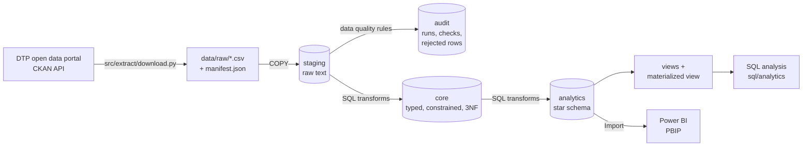

# Architecture

Everything from staging to analytics runs in **one database transaction**
(`python -m src.pipeline`). If any step fails, the previous successful load stays in place. The
run itself is logged in `audit.etl_run` on a separate connection, so failed runs are recorded too.

## Responsibilities

| Step | Tool | Why this tool |
|---|---|---|
| Download | Python (`requests`) | Calls the CKAN API for the current file list and writes a manifest with sizes and SHA-256 hashes |
| Load staging | Python (`psycopg` `COPY`) | `COPY` is the fastest bulk load into PostgreSQL. The CSV header is checked against the table first, so a change in the source files stops the load (schema drift) |
| Validate | SQL rules run from Python (`src/validation`) | Each rule is a set-based SQL condition. Python records the result in `audit.dq_check_result` and copies rejected rows to `audit.rejected_record` |
| Clean and model | SQL (`sql/transform`) | Casting, de-duplication and joins over hundreds of thousands of rows are what the database is built for |
| Bulk-load performance | Python (`src/load/constraints.py`) | Drops foreign keys before the load and recreates them afterwards. Recreating validates every row in one pass instead of one trigger call per row (2.3 s vs 115 s for one fact table) |
| Analyse | SQL (`sql/analytics`, `sql/views`) | One shared definition of each measure |
| Report on quality | Python (`src/validation/report.py`) | Writes `docs/data_quality_report.md` after every successful run |
| Visualise | Power BI (PBIP) | Imports the star schema. Model and pages are text files in Git; pages are generated by `powerbi/tools/build_report.py` |
| Test | pytest | Unit tests without a database, plus constraint and data tests against the loaded database |

This is closer to **ELT** than classic ETL: data is loaded into the database first and transformed there.

## Where to read more

| Topic | Document |
|---|---|
| Data model and design decisions | [`database_design.md`](database_design.md) |
| Columns of the analytics tables | [`data_dictionary.md`](data_dictionary.md) |
| Data quality rules and results | [`data_quality_assessment.md`](data_quality_assessment.md), [`data_quality_report.md`](data_quality_report.md) |
| Analysis results and conclusions | [`analysis_results.md`](analysis_results.md), [`key_insights.md`](key_insights.md) |
| Indexes and performance | [`query_optimisation.md`](query_optimisation.md), [`performance_results.md`](performance_results.md) |
| Views | [`views.md`](views.md) |
| Dashboard | [`dashboard_design.md`](dashboard_design.md), [`../powerbi/README.md`](../powerbi/README.md) |
