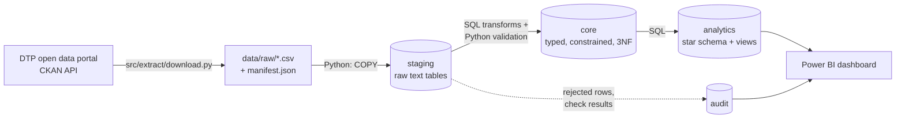

# Architecture

## Responsibilities

| Step | Tool | Why this tool |
|---|---|---|
| Download | Python (`requests`) | Calls the CKAN API, handles files and writes a manifest |
| Load staging | Python (`psycopg` `COPY`) | `COPY` is the fastest way to bulk load CSV into PostgreSQL |
| Validate | Python orchestrating SQL checks | Rules are expressed as set-based SQL queries; Python runs them, records results in `audit` and writes the report |
| Clean and transform | SQL | Type casting, de-duplication and joins on hundreds of thousands of rows are what the database is built for |
| Analyse | SQL views | Analysis logic lives in the database, so Power BI and ad hoc SQL use the same definitions |
| Visualise | Power BI | Connects to the `analytics` schema |

This is closer to **ELT** than classic ETL: data is loaded into the database first and transformed there.

See [`database_design.md`](database_design.md) for the data model and
[`data_quality_assessment.md`](data_quality_assessment.md) for the validation rules.
