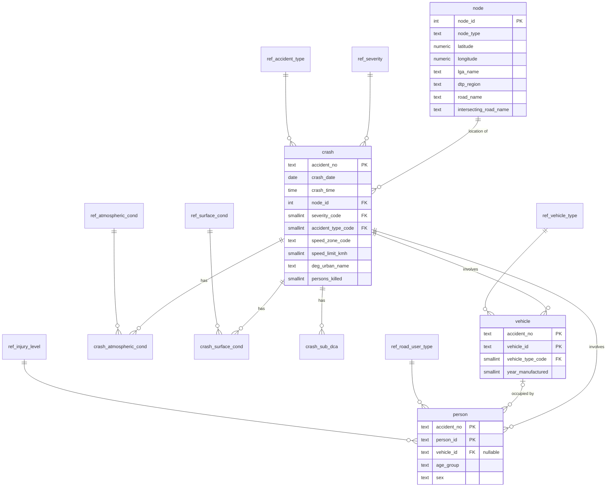
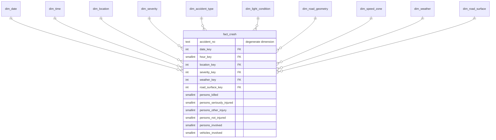

# Database Design

The design is based on the profiling results in
[`data_quality_assessment.md`](data_quality_assessment.md). Row counts quoted
here come from the snapshot in `data/raw/manifest.json`.

## 1. Layers

The database is split into four PostgreSQL schemas:

| Schema | Purpose | Modelling style |
|---|---|---|
| `staging` | Exact copy of each CSV file, every column as `TEXT`, plus the source row number | None - mirrors the files |
| `core` | Cleaned, typed and de-duplicated data with primary and foreign keys | Normalised relational (3NF) |
| `analytics` | Facts and dimensions for SQL analysis and Power BI | Dimensional (star schema) |
| `audit` | ETL runs, data quality check results and rejected records | Operational log |

### Why three data layers instead of one

- **staging** keeps the original values. When a value is fixed by a data quality rule, the original is still there to explain and audit the change. It also means the cleaning logic can be re-run without downloading the files again.
- **core** is the single trusted version of the data. Constraints enforce integrity in the database itself rather than relying on the ETL code being correct. This layer shows relational design.
- **analytics** is shaped for questions and dashboards. Descriptions are denormalised into a few wide dimensions, so queries need fewer joins and Power BI gets a clean star.

The cost is storing the data roughly three times and maintaining more SQL. At about 2 million rows in total this is a small price, and it is a common pattern in real data warehouses.

## 2. Key findings that shaped the design

| Finding | Design consequence |
|---|---|
| `accident.csv` has exactly one row per `ACCIDENT_NO`, and every other file references it | `core.crash` is the parent table, and the main fact has crash grain |
| `NODE_ID` is a stable location: every node has identical coordinates, LGA, postcode, region and road names across all of its crashes (143,808 nodes) | Location is its own entity (`core.node`, `analytics.dim_location`) instead of being repeated on every crash |
| `DEG_URBAN_NAME` is the only node attribute that varies between crashes at the same node | Stored on the crash, not on the node |
| Weather (up to 4), road surface (up to 3) and sub-DCA (up to 7) can have several values per crash | Separate child tables in core; "combination" dimensions in analytics (section 5) |
| One crash has many persons and many vehicles | Person and vehicle analysis need their own fact tables, not dimensions on the crash fact |
| Pedestrians have no vehicle | `person.vehicle_id` is nullable |
| Codes and descriptions are repeated on every row, e.g. `ACCIDENT_TYPE` + `ACCIDENT_TYPE_DESC` | Lookup tables in core |

## 3. Staging layer

There is one table per CSV file, for example `staging.accident` and `staging.person`. Each table has:

- every source column as `TEXT`, with column names converted to `snake_case`
- `source_row_number` - the line in the CSV, so any rejected record can be traced back to the file

No constraints are applied, because the goal is to load the files exactly as received. `accident_event.csv` is loaded to staging only; event-level analysis is out of scope (see Future improvements in the README).

## 4. Core layer (normalised)

The diagram shows the main columns only. The full column list is defined in Phase 4.

| Table | Grain | Primary key | Approx. rows |
|---|---|---|---|
| `crash` | one crash | `accident_no` | 200,754 |
| `node` | one location node | `node_id` | 143,808 + nodes found only in `accident.csv` |
| `person` | one person in one crash | (`accident_no`, `person_id`) | 467,730 |
| `vehicle` | one vehicle in one crash | (`accident_no`, `vehicle_id`) | 365,470 |
| `crash_atmospheric_cond` | one weather condition of one crash | (`accident_no`, `atmosph_cond_code`) | 202,905 |
| `crash_surface_cond` | one surface condition of one crash | (`accident_no`, `surface_cond_code`) | 201,829 |
| `crash_sub_dca` | one sub-DCA code of one crash | (`accident_no`, `sub_dca_code`) | 287,521 |
| `ref_*` | one code | the source code | 4-81 each |

Lookup tables:

- `ref_severity`
- `ref_accident_type`
- `ref_dca`
- `ref_light_condition`
- `ref_road_geometry`
- `ref_atmospheric_cond`
- `ref_surface_cond`
- `ref_sub_dca`
- `ref_vehicle_type`
- `ref_road_user_type`
- `ref_injury_level`

`accident.csv` has codes only for light condition and severity. Their descriptions come from the lite file, where the code-to-description mapping was checked to be one-to-one.

### Design decisions

- **Natural keys in core.** `ACCIDENT_NO`, `NODE_ID` and the source codes are stable identifiers assigned by the source system. Core is a cleaned copy of that system, so its keys are the source keys. Surrogate keys are introduced in the analytics layer, where they are actually needed (section 6).
- **Composite keys for person and vehicle.** `PERSON_ID` and `VEHICLE_ID` are letters (`A`, `B`, `C`, ...) that are only unique within a crash, so the key must include `accident_no`.
- **Person to vehicle foreign key.** The foreign key is (`accident_no`, `vehicle_id`) and nullable, because pedestrians have no vehicle. The 39 person rows that point to a vehicle not in `vehicle.csv` have `vehicle_id` set to NULL and are flagged (DQ19); the original value remains in staging.
- **Separate lookup tables, not one generic code table.** A single "all codes" table cannot have proper foreign keys or types per code set. This is a known anti-pattern ("one true lookup table").
- **Dropped or derived columns.**
  - The raw `DAY_OF_WEEK` code is not loaded, because it is unreliable (DQ06). The weekday is derived from the date.
  - `VEHICLE_POWER` is not loaded, because it is 100% empty.

## 5. Analytics layer (dimensional)

### Fact tables and grain

The original idea was a single `fact_crash` with `dim_person` and `dim_vehicle`. The data does not support that design. A crash has on average 2.3 persons and 1.8 vehicles, so a person cannot be a dimension of a crash row. Joining persons onto crashes would multiply crash counts.

The design therefore uses three fact tables that share the same dimensions (a "fact constellation"):

| Fact | Grain | Rows | Answers questions about |
|---|---|---|---|
| `fact_crash` | one row per crash | 200,754 | trends, severity, time, location, weather, surface, lighting |
| `fact_person` | one row per person involved in a crash | 467,730 | age groups, road user types, injury outcomes |
| `fact_vehicle` | one row per vehicle involved in a crash | 365,470 | vehicle types and their involvement in severe crashes |

Shared ("conformed") dimensions such as `dim_date`, `dim_location` and `dim_severity` mean the same filter works on all three facts. For example, selecting the year 2023 in Power BI filters crashes, persons and vehicles together.

### Star schema for `fact_crash`

The other two facts:

- `fact_person` uses `dim_date`, `dim_location` and `dim_severity` (the severity of the crash), plus:
  - `dim_road_user_type`
  - `dim_injury_level`
  - `dim_person_demographic`
  - `dim_vehicle_type` (the vehicle the person was in)
- `fact_vehicle` uses `dim_date`, `dim_location`, `dim_severity` and `dim_vehicle_type`. Its measures are occupants and vehicle age at the time of the crash.

### Dimensions

| Dimension | Grain / rows | Notable attributes |
|---|---|---|
| `dim_date` | one calendar day, generated for 2012-01-01 to 2026-12-31 | year, quarter, month, weekday derived from the date, `is_weekend`, southern-hemisphere `season`, `is_analysis_period` (2012-2024, see below) |
| `dim_time` | one hour (0-23) | hour label, time-of-day band |
| `dim_location` | one node | node type, latitude, longitude, LGA, DTP region, postcode, road and intersecting road, readable label (e.g. `SPRINGVALE ROAD / VISION DRIVE`), `is_unincorporated` |
| `dim_severity` | 4 severities | `is_fatal`, `is_fatal_or_serious` (KSI - killed or seriously injured, a standard road safety measure) |
| `dim_accident_type` | 9 types | description |
| `dim_light_condition` | 7 conditions | description, `is_dark` |
| `dim_road_geometry` | 9 geometries | description, `is_intersection` |
| `dim_speed_zone` | 13 codes | speed limit in km/h (NULL for special codes), speed band |
| `dim_weather` | 36 observed combinations | combined description (e.g. `Raining + Strong winds`), `has_rain`, `has_fog`, `has_strong_winds`, `is_not_known`, ... |
| `dim_road_surface` | 17 observed combinations | combined description, `has_wet`, `has_icy`, `has_muddy`, `is_not_known`, ... |
| `dim_road_user_type` | one per description | codes 2 and 7 (Drivers) and 3 and 8 (Passengers) are merged |
| `dim_injury_level` | 4 levels | description, sort order |
| `dim_person_demographic` | age group x sex | age group, age group sort order, sex description |
| `dim_vehicle_type` | 29 types | description, broader vehicle category |

DCA (crash movement) codes and sub-DCA codes are kept in core but not added to the star, because none of the planned questions need them. They can be added later without changing the fact grain.

### Multi-valued weather and road surface

A crash can be both "Raining" and "Strong winds". There were three options:

| Option | How it works | Trade-off |
|---|---|---|
| Bridge table | `fact_crash` → `bridge_crash_weather` → `dim_weather` | Most flexible, but needs a many-to-many relationship in Power BI and allocation weights to avoid double-counting crashes |
| Primary condition | Keep only one condition per crash | Simple, but throws information away, and there is no documented rule for which condition is "primary" (the meaning of the `SEQ` columns is unclear) |
| **Combination dimension (chosen)** | Each distinct combination is one dimension row (36 for weather, 17 for surface), with a boolean flag per condition | Keeps exactly one row per crash and loses no information. Questions like "crashes in rain" use the `has_rain` flag |

The combination approach works here because the number of observed combinations is small. If it grew into the thousands, a bridge table would be the better choice.

### Surrogate keys and unknown members

- Every analytics dimension uses an integer surrogate key, except two:
  - `dim_date` uses `YYYYMMDD`, for example `20240315`. This is readable and sorts correctly.
  - `dim_time` uses the hour itself.
- Natural keys, such as `node_id` and source codes, are kept as attributes so any row can be traced back to core.
- Why surrogate keys here:
  - They are small and fast to join.
  - They isolate the warehouse from changes in source codes.
  - They let the dimensions carry special members that do not exist in the source.
- Each dimension has an **Unknown** member with key `-1`. `dim_vehicle_type` also has a **Not applicable** member with key `-2`, used for pedestrians. Fact foreign keys are therefore never NULL, so:
  - inner joins never silently drop rows
  - Power BI shows "Unknown" instead of "(Blank)"
  - the number of unknowns is visible and can be reported
- Source values that mean "not known" (e.g. `AGE_GROUP = Unknown`, `SEX = U`, light condition `9`) map to real dimension rows with their own description. They are not the same as the `-1` member, which means "no value at all".

### Slowly changing dimensions

All dimensions are **Type 1**: they are rebuilt from the latest data on each load. The source publishes the current state of every crash rather than a change history, so Type 2 history tracking would add complexity without a real use case. If historical LGA boundaries mattered, `dim_location` would be the candidate for Type 2.

### Analysis period

The data is loaded in full, but recent months are incomplete (DQ24). `dim_date.is_analysis_period` is true for 2012-01-01 to 2024-12-31. Trend and year-over-year analysis, as well as the dashboard defaults, filter on this flag. Detail queries can still see all data.

## 6. Audit schema

| Table | Purpose |
|---|---|
| `audit.etl_run` | One row per pipeline run: start/end time, status, and the manifest snapshot used |
| `audit.dq_check_result` | One row per rule per run: rule ID (DQ01-DQ26), table, rows checked, rows failed, action taken |
| `audit.rejected_record` | Every rejected row: run, rule ID, reason, source table, source row number, and the original row as `JSONB` |

This is what makes data quality visible. The data quality report and a Power BI data quality page can be built directly from these tables.

## 7. Portability to Neon / Supabase

- Only standard PostgreSQL features are used: schemas, `IDENTITY` columns, constraints, `JSONB`, views and materialized views. No extensions are required.
- All DDL lives in `sql/` and is applied by scripts, so a hosted database is built the same way as the local one.
- Connection settings come only from `.env`. `DB_SSLMODE=require` is the only change needed for hosted databases.
