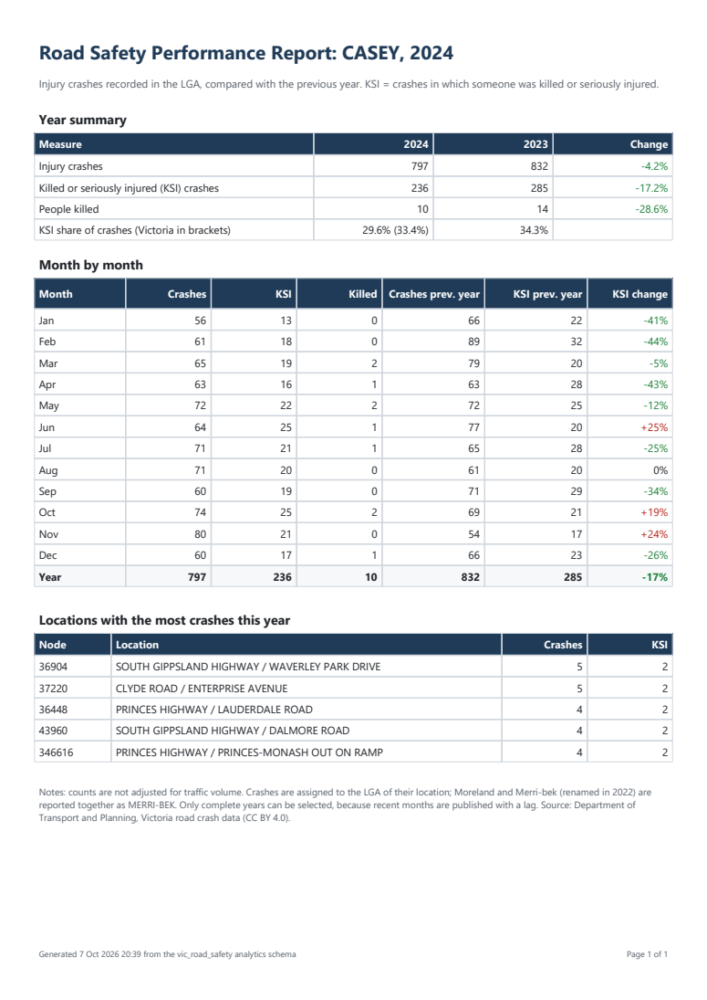

# Paginated Report

`lga_monthly_performance.rdl` is a printable monthly performance report for one LGA and year,
in RDL (Report Definition Language), the format used by SQL Server Reporting Services (SSRS) and
Power BI Report Builder.



Sample output: [sample_casey_2024.pdf](sample_casey_2024.pdf), exported from Power BI Report Builder.

| Section | Content |
|---|---|
| Year summary | Injury crashes, KSI crashes and people killed against the previous year, with the change. KSI share with the Victorian share in brackets |
| Month by month | Each month against the same month of the previous year, a year total, and the KSI change (red for a rise, green for a fall) |
| Top locations | The five locations with the most crashes in the year, with KSI crashes. Ties are broken by node ID so the list is reproducible |
| Footer | Generation time and page numbers |

Parameters:

- **LGA:** filled from the database. Moreland was renamed Merri-bek in 2022 and the crash data uses both names, so both are reported as MERRI-BEK (the same rule as the Power BI `lga_name_current` column).
- **Year:** only complete years that also have a complete previous year (2013-2024 in the current snapshot), so the comparison is never against a partly reported year.

## Files

| File | Purpose |
|---|---|
| `lga_monthly_performance.rdl` | The report. Generated: do not edit by hand |
| `build_rdl.py` | Builds the RDL, embedding the SQL below |
| `queries/*.sql` | One query per dataset. `?` marks an ODBC parameter: first the LGA, then the year |
| `sample_casey_2024.pdf`, `.png` | Exported output for CASEY, 2024 |

```bash
python reports/paginated/build_rdl.py
```

## Run the report

1. Install [Power BI Report Builder](https://www.microsoft.com/en-us/download/details.aspx?id=105942) (free) and the 64-bit [psqlODBC driver](https://www.postgresql.org/ftp/odbc/releases/) (`psqlodbc_x64.msi`).
2. Open `lga_monthly_performance.rdl` in Report Builder and click **Run**.
3. When asked, sign in to PostgreSQL. The read-only `powerbi_reader` role from [`sql/security/01_powerbi_reader.sql`](../../sql/security/01_powerbi_reader.sql) is enough.
4. Choose an LGA and a year, then **View Report**. **Export > PDF** gives the printable version.

The connection string is `Driver={PostgreSQL Unicode(x64)};Server=localhost;Port=5432;Database=vic_road_safety;`.
For another server, change `CONNECT_STRING` in `build_rdl.py` and rebuild, or edit the data source in
Report Builder.

## Checked values

The queries were run directly against the database before being embedded. For CASEY, 2024:

| Measure | 2024 | 2023 |
|---|---|---|
| Injury crashes | 797 | 832 |
| KSI crashes | 236 | 285 |
| People killed | 10 | 14 |

The twelve monthly rows add up to the year total (797), and the totals match an independent query
on `analytics.fact_crash`. The exported PDF shows the same values, including the five locations.

## Lessons from the first runs

- **Names must be unique across datasets and data regions.** A dataset and a table were both called `TopLocations`, and the report would not load. Tables are now named `...Table`.
- **A row too short for its text renders empty.** Detail rows of 0.22in with 9pt text and padding showed no values at all, while the totals row (0.24in) did. Rows are now 0.25in.
- **Positions are design positions.** A table is laid out with one detail row; rows added at run time push the items below it down. Positioning items for the expanded height left a large gap and spilled onto a second page.
- **Set the report language.** Without it, dates follow the viewer's Windows locale; the report now uses `en-AU`.

## Publishing

Report Builder can publish the report to the Power BI service, which needs a Power BI Pro or Premium
workspace and an on-premises data gateway with the ODBC driver to reach PostgreSQL. This has not been
done; the report runs locally.
